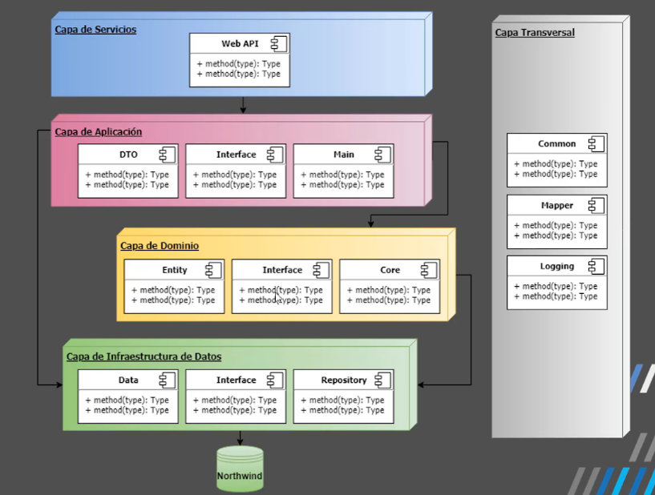
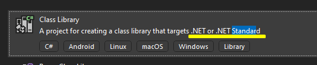
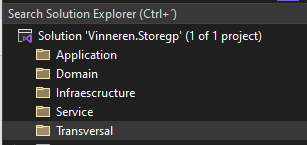

# ExamenVinnerenStoreGroup

# Arquitectura NCapas a utilizar

# Paso para la creacion del proyecto.
* Nota. Cada proyecto a excepcion del WebApi, se crearan con
.NetStandart

* Nota. El nombre del proyecto lleva:
    * > nombreEmpresa.nombreAplicacion.nombreCapa.nombreCaracteristica
* * Nota. El nombre de la solucion lo dejamos como:
    * > nombreEmpresa.nombreAplicacion

## Creamos el proyecto vacio y agregamos las siguientes carpetas

## Creamos capa Transversal
* Common

## Creamos capa de infraescructura de persistencia de datos.
* Data 
    * Instalamos el paquete
        * Microsoft.EntityFrameworkCore.SqlServer
        * Microsoft.EntityFrameworkCore.Tools
    * Creo la clase de context que herede de DbContext.
* Interface
* Repository 

## Creamos capa Dominio
* Core
* Entity
* Interface

## Creamos capa Aplicacion
* Dto
* Interface
* Main

## Creamos capa de Servicios
* WebApi

## Generando Infraescructura en diferentes capas(Aplicacion, Dominio, Persistencia de datos)

* Creamos todas las entitys en la capa de Dominio.Entity y algunas interfaces en Dominio.entity.

* Modifico el startup y el programa para configurar la migracion

* Configuro AutoMapper

* Creo todos los Dtos por tabla en capa de aplicacion.

* Creo mi interfaz y clase de UnitOfWork
    * > IUnitOfWork
    * > UnitOfWork : IUnitOfWork

* Creo mi interfaz de repositorio generico
    * > IRepositoryGenericTEntity

* Creo mi repositorio generico
    * > RepositoryGenericTEntity

* Creo mi interfaz de repo para tabla Category que implemente del 
repo generico
    * > ICategoryRepo<TEntity> : IRepositoryGenericTEntity<TEntity>

* Creo mi repositorio para la tabla Category e implemento y codifico todos los metodos
    * > CategoryRepo<TEntity> : ICategoryRepo<TEntity> where TEntity : class
* De la misma forma que cree ICategoryRepo y CategoryRepo asi sigo
construyendo los repositorios para las demas tablas.

